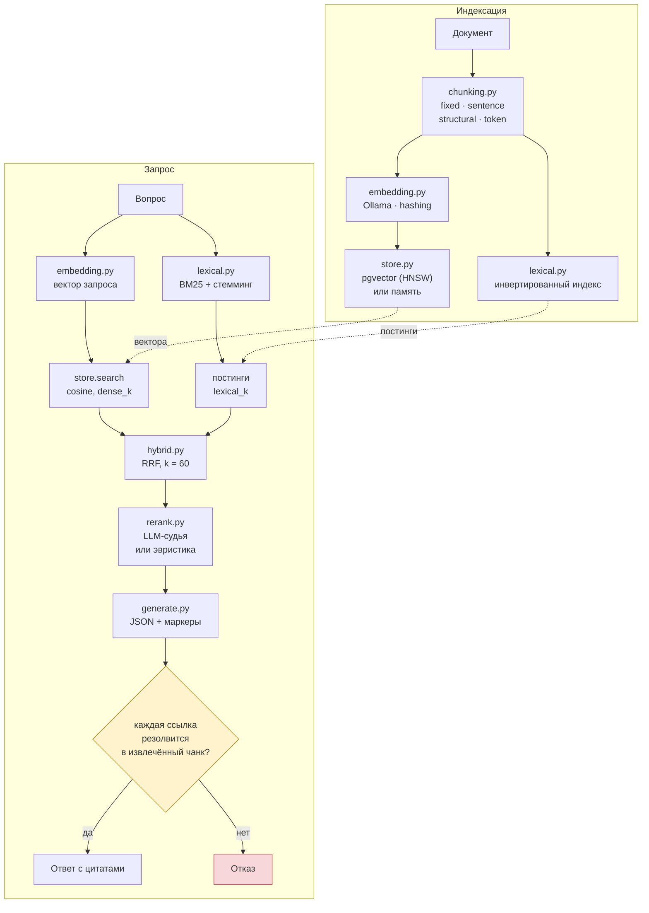

# rag-service

Retrieval-augmented generation, собранный из первых принципов — без LangChain и
LlamaIndex, — так, что каждую стадию видно, можно измерить и заменить одной строкой в
YAML.

---

## Задача

RAG выглядит просто ровно до первой жалобы «он отвечает ерунду». Дальше начинается
вопрос, на который фреймворк не отвечает: **на каком шаге всё сломалось?**

Вариантов немного, и они требуют разных действий:

- нужный текст вообще не попал в индекс — чанкер разрезал предложение пополам, и ни
  одна половина не отвечает на вопрос;
- текст в индексе есть, но эмбеддер его не находит — вопрос про `X-Kestrel-Quota-Remaining`,
  а вектор такого токена ничем не отличается от вектора любого другого заголовка;
- нашёлся, но не попал в top-k — потому что двадцать соседних чанков про то же самое;
- попал в контекст, но модель ответила из своих весов, а ссылку выдумала.

Готовый фреймворк отвечает на всё это одинаково: `chain.invoke(query)`. Внутри —
`RecursiveCharacterTextSplitter` с параметрами по умолчанию, `EnsembleRetriever` с
весами `[0.5, 0.5]` и промпт, в котором вежливо просят цитировать источники. Каждое из
этих решений влияет на качество сильнее, чем выбор модели, и ни одно не измерено.

Этот репозиторий устроен наоборот: восемь стадий конвейера — нарезка, эмбеддинги,
хранилище, BM25, фьюжен, переранжирование, генерация, сборка — живут в отдельных
модулях, выбираются конфигом и меряются harness'ом, который прогоняет любую комбинацию
по размеченному корпусу и печатает таблицу. Числа ниже получены его запуском, а не
взяты из статьи.

---

## Архитектура



Ключевая деталь диаграммы — ромб. Модель не называет источники: она получает
безымянные номера `[1] [2] [3]`, выданные на время этого запроса, и любой номер, который
не находится в таблице маркеров, вырезается из текста и из списка цитат. Если после
проверки не осталось ни одной ссылки — ответа не будет.

---

## Бенчмарк

Все числа ниже — вывод `make bench` на этой машине: 27 документов (25 131 символ),
106 вопросов с размеченным ответом, 8 вопросов, ответа на которые в корпусе нет.
Воспроизводится одной командой, без модели, без GPU и без Postgres:

```
$ python -m eval.harness --sweep
corpus: 27 документов, 25131 символов, 106 вопросов с ответом, 8 без ответа
```

### Стратегии чанкинга

Одинаковый поиск (гибрид, RRF, без переранжирования), четыре чанкера с сопоставимым
бюджетом:

| стратегия | чанков | recall@1 | recall@3 | recall@5 | precision@5 | MRR | nDCG@5 | p50 мс | p95 мс |
|---|---|---|---|---|---|---|---|---|---|
| fixed-800 | 42 | 0.807 | 0.948 | 0.981 | 0.215 | 0.903 | 0.921 | 6.0 | 8.3 |
| sentence-800 | 42 | 0.802 | 0.948 | 0.981 | 0.208 | 0.891 | 0.912 | 5.6 | 7.0 |
| structural-900 | 101 | 0.774 | 0.925 | 0.953 | 0.191 | 0.853 | 0.879 | 2.9 | 4.0 |
| token-180 | 30 | 0.840 | 0.972 | 0.991 | 0.198 | 0.904 | 0.926 | 6.9 | 8.7 |

### Режимы поиска

Один чанкер (`token-180`, победитель предыдущей таблицы), пять конфигураций поиска:

| режим поиска | чанков | recall@1 | recall@3 | recall@5 | precision@5 | MRR | nDCG@5 | p50 мс | p95 мс |
|---|---|---|---|---|---|---|---|---|---|
| dense | 30 | 0.755 | 0.943 | 0.972 | 0.194 | 0.849 | 0.880 | 6.7 | 8.5 |
| bm25 | 30 | 0.887 | 0.953 | 0.972 | 0.194 | 0.928 | 0.937 | 5.9 | 7.7 |
| hybrid rrf | 30 | 0.840 | 0.972 | 0.991 | 0.198 | 0.904 | 0.926 | 7.1 | 8.6 |
| hybrid min-max | 30 | 0.906 | 0.991 | 0.991 | 0.198 | 0.943 | 0.956 | 6.7 | 9.1 |
| hybrid rrf + rerank | 30 | 0.802 | 0.934 | 0.972 | 0.194 | 0.872 | 0.896 | 30.8 | 34.3 |

### Порог поддержки и отказы

`generation.min_support` — минимальная доля содержательных терминов вопроса, которую
предложение обязано разделять с контекстом, чтобы попасть в ответ. Ниже порога система
отказывается отвечать:

| min_support | ложный отказ (ответ есть) | верный отказ (ответа нет) | recall@5 | термины ответа |
|---|---|---|---|---|
| 0.00 | 0.000 | 0.000 | 0.991 | 0.757 |
| 0.20 | 0.000 | 0.000 | 0.991 | 0.755 |
| 0.34 | 0.160 | 0.750 | 0.991 | 0.652 |
| 0.50 | 0.292 | 0.875 | 0.991 | 0.555 |
| 0.67 | 0.651 | 1.000 | 0.991 | 0.260 |

`recall@5` в этой таблице не меняется — и это ровно то, что должно быть видно: порог
живёт в генерации, а не в поиске. Ничего не «теряется», система просто перестаёт
говорить о том, чего не нашла.

### Как это читать

Условия измерения важнее самих чисел, поэтому они названы явно.

**Эмбеддер здесь — детерминированная хеш-проекция, а не модель.** `HashingEmbedder` —
знаковое хеширование мешка стеммированных слов и символьных триграмм. Он существует,
чтобы CI и harness работали без сети, GPU и загрузки весов, и давали побайтово
одинаковый результат на любой машине. Его понятие «похожести» — это лексическое
пересечение с шумом. Отсюда два следствия:

1. строка `dense` в таблице — **нижняя граница**, а не прогноз для `bge-m3`;
2. `dense` и `bm25` здесь измеряют почти одно и то же, поэтому выигрыш гибрида
   (`recall@3` 0.972 против 0.943 и 0.953) занижен: настоящий бикодер ошибается
   иначе, чем BM25, и объединение двух разных ошибок даёт больше.

**Корпус небольшой и синтетический.** 27 документов, из них 12 — «соседние сервисы»
с намеренно тем же словарём (порт, квота, retention, реплики, журнал). Без них
`recall@5` упирается в 1.0 у любого чанкера и таблица перестаёт что-либо различать.

**Латентность — это латентность поиска, не генерации.** Офлайн-генератор
экстрактивный: он выбирает предложения из найденного, а не пишет текст. С реальной
моделью p50 определяется ею, а не этими 7 мс. Метрики качества воспроизводятся до
третьего знака от прогона к прогону (эмбеддер детерминированный, порядок фиксирован
явными тай-брейками); колонки `p50`/`p95` — от одного конкретного запуска и, разумеется,
дрожат.

Полный вывод, включая `faithfulness`, `answer_terms` и время индексации, лежит в
`eval/results.json` после `make bench`.

---

## Решения и компромиссы

### Почему не LangChain и не LlamaIndex

Аргумент не в том, что фреймворки плохие. Он в том, что **этот репозиторий про
измеримость каждой стадии, а фреймворк устроен так, чтобы стадии не были видны**.

Конкретно, что пришлось бы делать, чтобы получить таблицы выше на LangChain:

- **разметка.** Gold-разметка здесь — символьный диапазон в документе
  (`doc_id`, `start`, `end`), а не идентификатор чанка. Иначе сравнивать чанкеры
  нечестно: метка «релевантен чанк 7» значит разное при 400 и при 1200 символах.
  Это требует, чтобы сплиттер возвращал офсеты. `RecursiveCharacterTextSplitter`
  возвращает строки; `add_start_index=True` даёт начало, но не конец, и не даёт
  гарантии, что срезы покрывают документ без дыр;
- **инварианты.** Здесь тест `test_chunks_reconstruct_the_document` собирает документ
  обратно из чанков и сравнивает побайтово — для четырёх стратегий × шести текстов ×
  десяти конфигураций. Такой тест невозможно написать поверх сплиттера, который
  триммит пробелы и склеивает разделители;
- **объяснимость.** `FusedChunk.explain()` возвращает `overview::0003 rrf=0.01613
  dense#1 lexical#4` — почему этот чанк здесь и что о нём думал каждый ретривер.
  В `EnsembleRetriever` это внутренняя переменная.

Плюс обычная цена абстракции: чтобы понять, что именно уехало в модель, надо включать
`verbose` и читать чужой стек. Здесь `pipeline.py` — 250 строк, и порядок стадий виден
глазами.

Что фреймворк реально даёт и чего здесь нет: полсотни готовых загрузчиков документов,
интеграции с десятком векторных БД, агентные графы. Если задача — быстро подключить
Confluence, Notion и S3, брать надо их. Здесь один формат входа (текст + метаданные) и
две реализации хранилища.

### RRF против взвешенной суммы: измерение против фольклора

Классический аргумент за RRF: скоры несопоставимы. Косинус нормированного эмбеддера
живёт в узкой полосе — хорошее совпадение 0.71, случайное 0.58, — а BM25 не ограничен
сверху и начинается с нуля. Min-max нормализация растягивает *тот разброс, который
случайно оказался на этом запросе*, до полного отрезка [0, 1]: запрос, где все dense-
кандидаты посредственные, получает уверенную 1.0. Плюс константы нормализации зависят
от состава списка, то есть скор чанка меняется от появления в выдаче другого, никак с
ним не связанного чанка. Ранги от этого не зависят.

**Но на этом корпусе min-max выиграл.** `recall@1` 0.906 против 0.840, MRR 0.943 против
0.904. Это в таблице, и я не собираюсь это прятать.

Объяснение, а не оправдание: с хеш-эмбеддером оба ретривера считают почти одно и то же
— лексическое пересечение. Их скоры коррелированы и разбросы похожи, так что главная
опасность нормализации не срабатывает, а её главное преимущество — сохранение отрыва
между первым и вторым местом — работает в полную силу. RRF этот отрыв выбрасывает: с
`k = 60` разница между рангом 1 и рангом 2 составляет 1.6 %.

Что из этого следует для дефолта. RRF оставлен по трём причинам, ни одна из которых не
опровергается этой таблицей:

1. **Пустой список.** BM25 не возвращает ничего, если ни один термин запроса не
   встретился. При score-фьюжене dense нормализуется против пустого списка; при RRF
   лексический вклад просто отсутствует, и dense-порядок проходит насквозь без
   изменений (`test_an_empty_lexical_list_leaves_the_dense_order_untouched`).
2. **Разнородные шкалы.** Условия, при которых min-max выиграл, — это условия
   «оба ретривера лексические». С настоящим бикодером они перестают выполняться, и
   измерение надо повторять.
3. **Отсутствие калибровки.** Веса RRF — это «насколько мы доверяем ретриверу»;
   веса score-фьюжена — это ещё и «в каких единицах он говорит», а единицы меняются
   при смене модели эмбеддингов.

Поэтому в коде есть оба (`retrieval.fusion.method: rrf | weighted`), harness меряет
оба, и правильный ответ на «что выбрать» — прогнать `make bench` на своих данных.
Это, собственно, и есть смысл репозитория.

Отдельно про `k = 60`. Это не магия, а ручка демпфирования: отношение вклада ранга 1 к
рангу 2 равно `(k + 2) / (k + 1)`. При `k = 60` это 1.6 %, при `k = 1` — 50 %.
`test_damping_decides_whether_agreement_beats_a_single_top_hit` показывает границу
буквально: чанк, который оба ретривера поставили пятым, при `k = 60` обгоняет чанк,
который один ретривер поставил первым, а второй не нашёл вовсе; при `k = 1` — нет.

### HNSW: где именно теряется recall

Три параметра, и путают их постоянно, потому что два из них нельзя поменять после
сборки индекса:

| параметр | когда действует | что даёт | цена |
|---|---|---|---|
| `m` | сборка | связность графа, потолок recall | память ~`m × 8` байт на вектор, медленнее вставка |
| `ef_construction` | сборка | качество соседей у каждой вершины | время построения индекса |
| `ef_search` | запрос | сколько вершин обходим | латентность запроса |

Практически важно одно: **`ef_search` — верхняя граница числа кандидатов**. Обход HNSW
посещает не больше `ef_search` вершин, поэтому `LIMIT 40` при `ef_search = 20` вернёт
меньше сорока строк, и выглядеть это будет как провал recall, а не как ошибка
конфигурации. Поэтому `AppConfig` падает на старте, если
`store.hnsw.ef_search < retrieval.dense_k` — это единственная ошибка конфигурации,
которая маскируется под проблему качества (`test_ef_search_below_dense_k_is_rejected`).

Вторая ловушка — фильтры. Метаданные фильтруются через jsonb-containment (`@>`) с
GIN-индексом, а не отдельными колонками: добавить новое поле для фильтрации ничего не
стоит на уровне схемы. Цена честная и она в другом месте — Postgres применяет
`WHERE metadata @> ...` **после** обхода графа. Если под фильтр попадает 1 % корпуса,
из `ef_search = 64` кандидатов останется в среднем меньше одного. Лечится либо
поднятием `ef_search`, либо — правильнее — вынесением реально селективного поля в
отдельную колонку с btree-индексом. Дефолт `m = 16, ef_construction = 64, ef_search = 64`
— разумная отправная точка для сотен тысяч чанков, а не универсальный ответ.

Числа recall/latency для самого HNSW я **не измерял**: для этого нужен корпус на
несколько порядков больше нынешних 25 КБ, где приближённый поиск начинает отличаться от
полного перебора. `InMemoryVectorStore` делает полный перебор и служит эталоном, против
которого такое измерение и надо ставить.

### Размер чанка: recall против размывания контекста

Таблица чанкинга показывает не «какой чанкер лучше», а компромисс.

`structural-900` даёт 101 чанк — он режет по заголовкам и абзацам, и в этом корпусе
секции короткие. Мелкие чанки → выше precision по смыслу, но `recall@1` падает до
0.774: ответ чаще оказывается не первым, потому что рядом лежат четыре похожих коротких
куска. `token-180` даёт 30 чанков, `recall@1` 0.840 — крупный чанк почти всегда
содержит ответ целиком.

Обратная сторона крупных чанков не видна в retrieval-метриках вообще. Она в
`precision@5`: 0.198 означает, что примерно 80 % контекста, отправленного в модель, к
вопросу отношения не имеет. При `final_k = 6` и чанках по 900 символов это ~5.4 КБ
текста, из которых нужен один абзац. Модель платит за это токенами и вниманием, и
именно так выглядит «нашли правильно, ответили мимо».

Практический вывод: **это две разные ручки, и настраивать их надо порознь.** Размер
чанка — под retrieval (`recall@k`), `final_k` — под генерацию (`precision@k` и длину
контекста). Здесь: `token-180` для поиска, `final_k = 6` для контекста.

Отдельно — почему у всех чанкеров есть жёсткий инвариант покрытия. Ни одна стратегия не
имеет права оставить дыру: `chunks[0].start == 0`, `chunks[-1].end == len(text)`,
`chunks[i+1].start <= chunks[i].end`. Это не педантизм. Чанкер, который на определённом
размере проглатывает последний абзац документа, не падает и не логирует — он просто
навсегда делает часть корпуса ненаходимой. `reconstruct()` собирает документ обратно и
сравнивает побайтово; тест гоняет это по всем комбинациям стратегий и текстов.

### Переранжирование: когда окупается и когда нет

В таблице оно **проиграло**: `nDCG@5` 0.896 против 0.926 без него, при этом p50 вырос с
7.1 до 30.8 мс — в 4.3 раза.

Почему так и почему это ожидаемо. Офлайн-реранкер (`HeuristicReranker`) считает покрытие
терминов запроса, их близость друг к другу и плотность. Это лексические признаки —
ровно те, которые BM25 уже учёл и учёл лучше, потому что у него есть IDF. Реранкер
здесь не добавляет информации, он добавляет шум и латентность.

Настоящий реранкер добавляет одно: **совместное кодирование запроса и документа**.
Бикодер сравнивает два независимых вектора, BM25 сравнивает статистику терминов, и
никто из них не может заметить, что чанк содержит все слова вопроса и отвечает при этом
на другой вопрос. Реранкер может.

Когда он окупается:

- когда `recall@20` заметно выше `recall@5` — есть что переставлять. Если ответ и так в
  топ-3, переставлять нечего;
- когда запросы формулируются словами, а не идентификаторами: у «как настроить срок
  хранения» много почти-совпадений, у `KR-3007` — одно;
- когда бюджет генерации ограничен, и надо ужать 20 кандидатов до 4 без потери ответа.

Когда не окупается: интерактивный поиск-подсказка, точные идентификаторы, короткий
корпус — и всегда, если это pointwise-реранкер по HTTP. Реализация здесь именно такая:
N кандидатов = N последовательных запросов к Ollama. Поэтому `rerank.top_n` маленький
(15 в продовом профиле), а `provider: none` — дефолт офлайн-профиля.

Ollama не отдаёт cross-encoder (нет sequence classification), поэтому в роли
совместного скорера — инструктивная модель, которую просят вернуть
`{"score": 0..10}` со схемой ответа. Это дороже настоящего cross-encoder'а и хуже
калибровано; называть класс `LlmJudgeReranker`, а не `CrossEncoderReranker`, — часть
честности. Падение реранкера не роняет ответ: он откатывается на эвристику, потому что
порядок после фьюжена уже пригоден к употреблению
(`test_a_failing_judge_falls_back_instead_of_taking_the_answer_down`).

### Почему цитаты обеспечены структурно, а не промптом

Промпт «обязательно указывай источник» даёт источники, которые **выглядят** правильно:
правдоподобное имя файла, правдоподобный номер раздела — в том числе для чанков,
которых в контексте не было. Это не редкий сбой, это то, чем занимается языковая
модель.

Поэтому модели не дают называть источник вообще. Механика:

1. `build_context()` нумерует извлечённые чанки `1..N` и строит таблицу маркеров.
   Номера действуют только внутри этого запроса;
2. модель возвращает `{"answer": "...", "citations": [1, 3]}` по JSON-схеме;
3. `enforce_citations()` резолвит каждый номер — и из массива, и из текста ответа.
   Не резолвится — вырезается **и из списка, и из текста**: оставить `[7]` в тексте,
   убрав 7 из цитат, значит показать читателю источник, за который система не отвечает;
4. не осталось ни одной ссылки → отказ, а не ответ без источников.

Пустая выдача обрабатывается тем же кодом без единой ветки: нет чанков → нет маркеров →
резолвиться нечему → отказ, и модель не вызывается вообще. Экономия запроса тут
приятный побочный эффект; главное — что путь отказа не отдельная логика, которую можно
забыть протестировать.

Цена — стриминг. Валидировать цитаты можно только после последнего токена, а текст уже
у клиента. Притворяться, что конфликта нет, нельзя, поэтому он вынесен в протокол: SSE
отдаёт `sources` → `delta`* → `answer`, и `answer` авторитетен. Если он приходит с
`refused: true`, клиент обязан выбросить показанное. Тест
`test_streamed_text_can_be_retracted_by_the_final_event` проверяет ровно этот сценарий.

Чтобы стримить `answer` из потока JSON, написан инкрементальный извлекатель строкового
поля (`JsonStringFieldStreamer`): он разбирает экранирование по мере поступления,
включая `\uXXXX`, разорванный между чанками. Сорок строк — дешевле, чем отказ от
структурного вывода ради возможности стримить сырой текст.

### Стемминг, а не лемматизация

BM25 по русскому тексту без морфологической нормализации почти бесполезен: «настройка»,
«настройки» и «настройке» — три разных термина, и запрос почти никогда не попадает в ту
форму, которую использовал автор.

Полноценная лемматизация (pymorphy3) — это 15 МБ словарей в образе, заметная стоимость
на токен и зависимость, которую надо версионировать. Стемминг даёт большую часть того
же выигрыша даром: в `rag/stemming.py` реализованы Porter (1980) для английского и
Snowball для русского, обе — по опубликованным алгоритмам.

Реализации сверены с эталонными (`snowballstemmer`, алгоритмы `porter` и `russian`) на
**245 739 русских словоформах и 23 662 английских словах — расхождений нет**. Сама
библиотека при этом не является зависимостью: она использовалась один раз при
разработке, а в `tests/test_stemming.py` зафиксирован читаемый срез той сверки.

Что стемминг теряет по сравнению с лемматизацией: супплетивные формы («человек» /
«люди»), омонимию, и он даёт основы, а не слова — «хранения» → `хранен`. Для точного
совпадения терминов в BM25 это неважно (важно лишь, чтобы запрос и документ
схлопывались в одно), для показа пользователю — важно, поэтому в цитатах хранится
исходный текст чанка, а не нормализованный. Точка расширения обозначена: `Analyzer` —
это данные, а не поведение, и подменяется целиком.

### BM25 в памяти, а не Elasticsearch

BM25 — одна формула и словарь постингов. Тащить ради этого поисковый движок — больше
движущихся частей, чем во всём остальном сервисе.

Индекс не персистится: он перестраивается из векторного хранилища
(`rebuild_lexical_index`). Так исчезает целый класс багов «два индекса разошлись»:
после `delete_document` лексический индекс не может остаться со старыми чанками,
потому что он строится из того же источника. Цена — время старта, линейное по числу
чанков, и оперативная память под постинги.

Граница применимости названа честно: сотни тысяч чанков — нормально, дальше правильный
ход не «побольше словарь», а полнотекстовый поиск Postgres (данные уже там) или
выделенный движок.

### Что синтетический eval показывает и чего не показывает

Корпус — вымышленная документация вымышленной платформы Kestrel, сгенерированная из
семени. Это осознанный выбор, а не отсутствие датасета: любой публичный QA-корпус
приносит лицензию, вес и вопрос «а не был ли он в обучающей выборке модели».

Как устроена разметка: факт пишется один раз — предложением плюс вопросами, на которые
оно отвечает. Сборщик кладёт это предложение в секцию документа, а gold-разметкой
становится его символьный диапазон в готовом тексте. Поэтому разметка не может
разойтись с текстом, и она **чанкер-независима**: harness превращает диапазон в
множество перекрывающихся чанков для той нарезки, которая тестируется. Генератор сам
проверяет, что каждое gold-предложение встречается в документе ровно один раз, а тест
`test_committed_files_match_what_the_generator_produces` — что закоммиченные JSONL
совпадают с выводом генератора.

**Что этот корпус меряет честно:** сравнение чанкеров между собой; сравнение режимов
поиска; регрессии — если после правки `recall@5` упал с 0.991 до 0.93, что-то сломалось;
поведение на вопросах без ответа.

**Чего он не меряет:**

- *абсолютное качество.* 0.991 recall@5 на 27 документах не переносится ни на что;
- *сложность реальных вопросов.* Здесь один факт — одно предложение. В жизни ответ
  бывает размазан по трём разделам, и это отдельная задача (multi-hop), которой тут нет;
- *грязный вход.* Корпус — аккуратный markdown. Ни PDF-колонок, ни таблиц, ни OCR;
- *качество эмбеддингов.* См. раздел «Как это читать»;
- *faithfulness как содержательную метрику.* Реализованная метрика — лексическая:
  доля содержательных терминов ответа, встречающихся в процитированных чанках. Она
  ловит уход модели «в свои веса» (словарь тогда не совпадает вообще), но перефразировку
  считает неподтверждённой, а красивую ложь из слов контекста — подтверждённой. С
  экстрактивным генератором она равна 1.000 по построению и полезна только как проверка
  того, что структурная гарантия цитат не сломана — harness падает, если хоть один
  ответ сослался на неизвлечённый чанк.

Что было бы правильно добавить перед продом: сотня-другая реальных вопросов от
пользователей с ручной разметкой. Синтетика хороша для регрессий и сравнений, но
калибровать пороги (тот же `min_support`) надо на настоящем распределении запросов.

### Прочие решения, короче

**Заголовок приписывается к тексту чанка перед эмбеддингом.** Кусок из середины раздела
«по умолчанию 30 секунд» — предложение ни о чём; с префиксом
`Конфигурация брокера > Хранение` оно находится. Стоит несколько токенов на чанк.

**Переиндексация документа сначала удаляет его чанки.** Иначе при смене размера чанка
старые остаются в индексе, продолжают набирать скор и никогда не цитируются корректно
(`test_reindexing_replaces_the_old_chunks`).

**`extra="forbid"` во всех моделях конфига.** Опечатка в ключе YAML, которую молча
проигнорировали, — это сервис, работающий с параметрами, которых никто не выбирал.

**Векторные литералы для pgvector форматируются вручную,** без пакета `pgvector`:
`'[0.5,-0.25,1]'::vector` — это одна функция и на одну зависимость меньше.

**Ретраи только на 408/429/5xx и сетевые ошибки.** 400 от Ollama означает, что запрос
неправильный; повторить его пять раз — только отложить ошибку на две секунды.

**Стрим никогда не заканчивается трейсбеком.** Исключение внутри SSE-генератора
превращается в кадр `event: error`, иначе соединение висит, а UI крутит спиннер.

---

## Быстрый старт

### Офлайн, без Docker

Ничего внешнего не нужно: хеш-эмбеддер, хранилище в памяти, экстрактивный генератор.

```bash
pip install -e ".[dev]"

make test          # 319 тестов
make bench         # таблицы из этого README
make query QUESTION="Какой порт использует брокер?"
```

```json
{
  "query": "Какой порт использует брокер?",
  "answer": "Брокер принимает клиентские подключения на порту 7420. [1] …",
  "refused": false,
  "citations": [{"marker": 1, "chunk_id": "overview::0001", "doc_id": "overview", "quote": "…"}],
  "timings_ms": {"dense": 0.45, "lexical": 0.17, "fusion": 0.07, "generation": 1.98}
}
```

### Полный стенд

```bash
cp .env.example .env      # поправить пароль
make up                   # postgres + pgvector, ollama, api
make models               # bge-m3, qwen2.5:3b, qwen2.5:7b-instruct — один раз
make index CONFIG=config/pgvector.yaml
```

```bash
curl -s localhost:8000/health | jq

curl -s localhost:8000/query \
  -H 'content-type: application/json' \
  -d '{"query": "Чему равен retention.hours по умолчанию?"}' | jq

curl -N localhost:8000/query/stream \
  -H 'content-type: application/json' \
  -d '{"query": "Как восстановить кластер из снапшота?"}'
```

### Цели Makefile

| цель | что делает |
|---|---|
| `up` / `down` | поднять / снести стенд вместе с томами |
| `models` | скачать модели в Ollama (один раз, несколько ГБ) |
| `index` | проиндексировать корпус выбранным `CONFIG` |
| `query` | один вопрос в CLI, `QUESTION="..."` |
| `eval` | harness один раз на `CONFIG` |
| `bench` | все три сравнения + `eval/results.json` |
| `dataset` | пересобрать корпус из семени |
| `test` / `lint` / `typecheck` | pytest / ruff / mypy --strict |
| `check` | всё, что гоняет CI |

---

## Конфигурация

Один YAML описывает весь конвейер. Три профиля в `config/`: `offline.yaml` (ничего
внешнего, им пользуются тесты и harness), `default.yaml` (Ollama + память),
`pgvector.yaml` (стенд целиком). `${VAR}` и `${VAR:умолчание}` подставляются из
окружения.

| секция | ключ | значения / умолчание | зачем |
|---|---|---|---|
| `chunking` | `strategy` | `fixed` · `sentence` · `structural` · `token` | стратегия нарезки |
| | `options` | зависят от стратегии | `size`/`overlap`, `max_chars`/`overlap_sentences`, `max_chars`/`min_section_chars`, `max_tokens`/`overlap_tokens` |
| `embedding` | `provider` | `hashing` · `ollama` | офлайн-детерминизм или реальная модель |
| | `model` | `nomic-embed-text` | модель Ollama |
| | `dim` | `512` | обязана совпадать с шириной модели, иначе `DimensionMismatchError` |
| | `batch_size` | `32` | размер батча к `/api/embed` |
| | `seed` | `20260214` | семя хеш-эмбеддера |
| `store` | `backend` | `memory` · `pgvector` | |
| | `metric` | `cosine` · `l2` | метрика и класс операторов индекса |
| | `dsn` | — | обязателен для `pgvector` |
| | `hnsw.m` | `16` | связность графа (сборка) |
| | `hnsw.ef_construction` | `64` | качество графа (сборка) |
| | `hnsw.ef_search` | `64` | обход при запросе; **не ниже `dense_k`** |
| `lexical` | `enabled` | `true` | выключить BM25 целиком |
| | `k1` / `b` | `1.5` / `0.75` | насыщение TF и нормализация длины |
| | `use_stemming` | `true` | стемминг в анализаторе |
| | `min_token_length` | `2` | порог длины токена |
| `retrieval` | `dense_k` | `30` | кандидатов от векторного поиска, `0` — выключить |
| | `lexical_k` | `30` | кандидатов от BM25, `0` — выключить |
| | `final_k` | `6` | сколько уходит в генерацию |
| | `fusion.method` | `rrf` · `weighted` | фьюжен рангов или нормализованных скоров |
| | `fusion.k` | `60` | демпфирование RRF |
| | `fusion.dense_weight` / `lexical_weight` | `0.5` / `0.5` | доверие ретриверам |
| `rerank` | `provider` | `none` · `heuristic` · `ollama` | |
| | `model` | `qwen2.5:3b` | модель-судья |
| | `top_n` | `20` | окно переранжирования, `>= final_k` |
| `generation` | `provider` | `extractive` · `ollama` | |
| | `model` | `qwen2.5:7b-instruct` | |
| | `max_context_chars` | `6000` | бюджет контекста; лишние чанки отбрасываются целиком |
| | `max_chunk_chars` | `1500` | обрезка одного чанка |
| | `temperature` | `0.0` | |
| | `max_sentences` | `3` | предложений в экстрактивном ответе |
| | `min_support` | `0.0` | порог доказательности, см. таблицу отказов |
| `ollama` | `base_url` | `http://localhost:11434` | |
| | `timeout_seconds` | `60` | |
| | `max_attempts` / `backoff_seconds` | `3` / `0.5` | ретраи на 408/429/5xx и сеть |

---

## HTTP API

| метод | путь | назначение |
|---|---|---|
| `GET` | `/health` | `ok` / `empty` плюс состав конвейера и число чанков |
| `POST` | `/index` | `{"documents": [{"doc_id", "text", "metadata"}]}` |
| `POST` | `/query` | ответ, цитаты, выдача и тайминги по стадиям |
| `POST` | `/query/stream` | SSE: `sources` → `delta`* → `answer` (или `error`) |

`/health` различает «процесс поднялся» и «может отвечать»: пустой индекс — валидное
состояние, но балансировщику стоит знать разницу.

---

## Структура репозитория

```
rag/
  types.py       Document, Chunk (со смещениями), Answer, Citation
  text.py        токенизация, границы предложений, Analyzer
  stemming.py    Porter (en) и Snowball (ru) — сверены с эталоном
  chunking.py    четыре стратегии + инвариант покрытия + reconstruct()
  embedding.py   HashingEmbedder (офлайн) и OllamaEmbedder (батчи, ретраи, dim)
  store.py       InMemoryVectorStore и PgVectorStore (HNSW, jsonb-фильтры)
  filtering.py   общий предикат фильтрации для обоих ретриверов
  lexical.py     BM25 с инвертированным индексом
  hybrid.py      RRF и min-max фьюжен
  rerank.py      LLM-судья с откатом на эвристику
  generate.py    контекст, структурная проверка цитат, отказ, стриминг JSON
  pipeline.py    сборка стадий и тайминги
  config.py      YAML → pydantic, extra="forbid"
  ollama.py      HTTP-клиент: батчи, ретраи, стриминг
  cli.py         индексация и запрос из терминала

eval/            подробности — в eval/README.md
  metrics.py     recall@k, precision@k, MRR, nDCG@k, faithfulness
  harness.py     три сравнения, таблицы, JSON
  datasets/      генератор корпуса + закоммиченные JSONL

api/             FastAPI: /health, /index, /query, /query/stream
tests/           319 тестов, все офлайн
config/          offline · default · pgvector
```

---

## Что проверяет CI

`.github/workflows/ci.yml`, версии actions зафиксированы:

- `ruff check .`;
- `mypy --strict rag eval api tests`;
- `pytest` — весь набор офлайн, сервисы CI не нужны;
- корпус пересобирается и сравнивается с закоммиченным (`git diff --exit-code`) —
  если генератор и данные разошлись, числа в этом README перестают быть проверяемыми;
- `make bench` — sweep должен отработать без падений, в том числе проверка, что ни один
  ответ не сослался на неизвлечённый чанк;
- `docker compose config --quiet` и сборка образа.

---

## Ограничения

- Реранкер поточечный и последовательный: N кандидатов = N запросов к Ollama.
  Батчинг или listwise-схема — очевидное следующее улучшение.
- Лексический индекс живёт в памяти одного процесса. Горизонтально сервис пока не
  масштабируется: каждая реплика строила бы свою копию.
- Multi-hop-вопросов нет ни в корпусе, ни в конвейере: одна итерация поиска, без
  переформулировки запроса и без обхода по ссылкам.
- Метрика faithfulness лексическая, её потолок описан выше.
- Числа recall/latency для самого HNSW не измерены — нужен корпус на порядки больше.

---

## Лицензия

MIT, см. [LICENSE](LICENSE).
